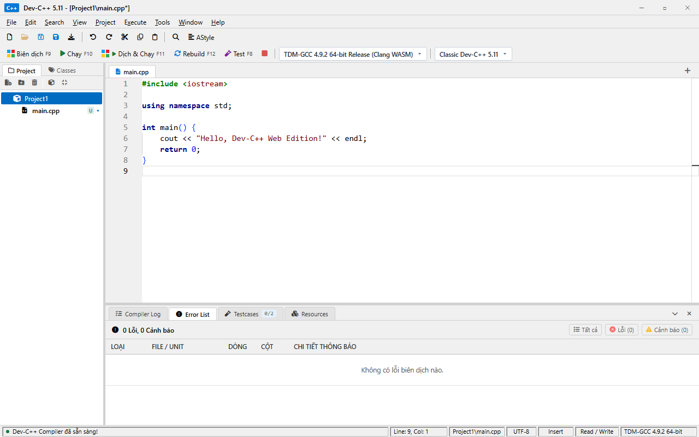
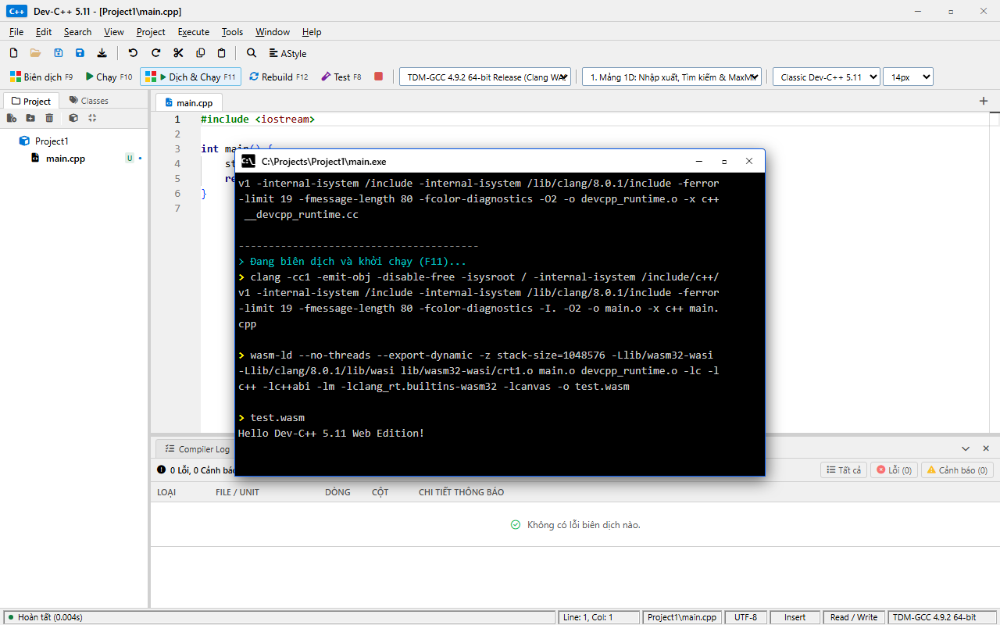
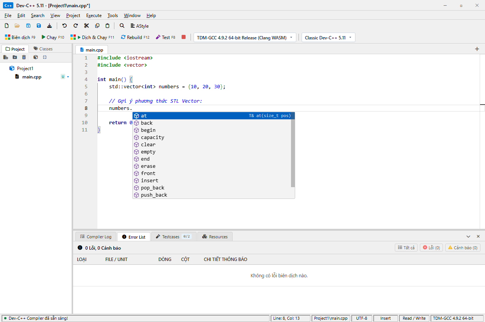
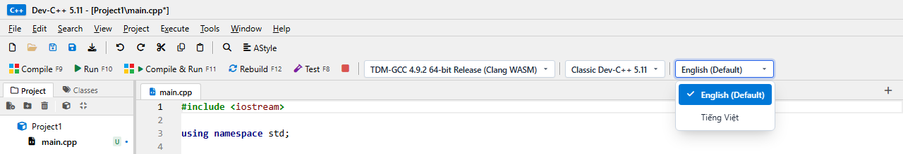
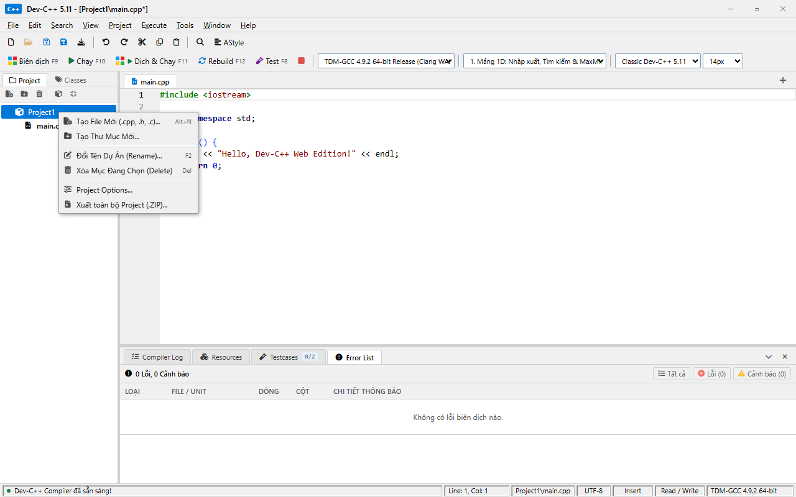
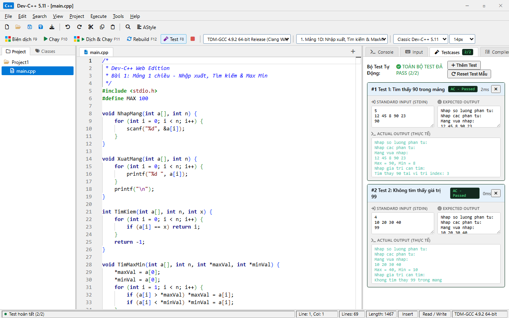
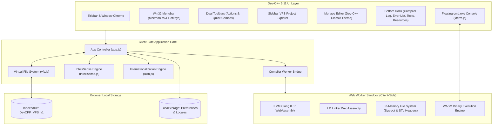

# Dev-C++ Web Edition

[](https://onlytrisdev.github.io/devcpp-web/)
[](https://webassembly.org/)
[](https://clang.llvm.org/)
[](https://en.cppreference.com/)
[]()
[](LICENSE)

A faithful, fully featured in-browser recreation of the classic **Bloodshed / Embarcadero Dev-C++ 5.11 IDE**. 

Dev-C++ Web Edition delivers a complete C and C++ development environment running **100% client-side** inside modern web browsers. It compiles native C/C++ source code directly to WebAssembly using an in-browser LLVM Clang toolchain—requiring **zero backend execution servers, zero container infrastructure, and zero remote code execution APIs**.

---

## Visual Showcase

### Classic IDE Workspace


---

### Floating Win32 Command Prompt (`cmd.exe`)
Interactive floating console with non-blocking standard I/O streaming, real-time keyboard input, and authentic Dev-C++ process termination diagnostics.



---

### Intelligent C/C++ Code Completion (IntelliSense)
Deep member resolution for structs, classes, self-referencing pointers (linked lists, trees), and standard template library containers (`std::vector`, `std::string`, `std::map`).



---

### Toolbar Language Quick Switcher
Seamless bilingual support with English (Default) and Vietnamese (Tiếng Việt), with live DOM re-rendering, hotkey mnemonics, and synchronized checkmarks.



---

### Virtual File System & Project Manager
Sidebar tree manager with multi-file project support, context menu operations, unit inclusion toggling, and IndexedDB persistence.



---

### Automated Test Runner & Diagnostics Dock
Automated batch testcase executor alongside real-time compiler log and error list with one-click code navigation.



---

## Core Capabilities

### 1. In-Browser LLVM Clang Toolchain
- **LLVM Clang 8.0.1 + LLD Linker**: Compiled directly to WebAssembly for client-side execution.
- **Sysroot & Headers**: Includes full C and C++ standard library headers (`<iostream>`, `<vector>`, `<string>`, `<map>`, `<algorithm>`, `<cmath>`, `<cstdio>`, `<memory>`, `<thread>`, etc.).
- **Multi-File Compilation**: Automatically detects all project source units (`.cpp`, `.c`) and headers (`.h`), writes them to a virtual in-memory file system (MemFS), and compiles and links them into an executable WebAssembly binary in a single pass.
- **Zero Server Dependency**: No code leaves the user's browser. Execution is safe, instantaneous, and isolated within browser sandboxing.

### 2. Authentic Win32 Floating Console Window
- **Classic Win32 Command Prompt**: Rendered as a draggable, resizable window styled after Windows `cmd.exe`.
- **Direct Interactive I/O**: Character-by-character non-blocking keyboard input stream for `std::cin`, `scanf()`, and `getchar()`.
- **Exit Status & Execution Timing**: Displays standard Dev-C++ execution summary upon termination:
  ```text
  --------------------------------
  Process exited after 0.042 seconds with return value 0.
  Press any key to continue . . .
  ```
- **Control Actions**: Copy terminal buffer, clear screen, and send EOF (`Ctrl+D`) signals.

### 3. Intelligent C/C++ Autocompletion (IntelliSense)
- **Deep Member Resolution**: Triggers automatically on dot (`.`) and arrow (`->`) operators.
- **Pointer & Recursive Type Navigation**: Resolves nested pointer chains such as `head->next->next->val` across singly/doubly linked lists and tree structures.
- **Standard Library Autocomplete**: Out-of-the-box IntelliSense for major C++ STL containers including `vector`, `string`, `map`, `unordered_map`, `set`, `queue`, `stack`, `deque`, `list`, and `pair`.
- **Toggleable via Hotkey**: Users can enable or disable suggestions at will via `Alt+I` or through `Tools -> Code Suggestions (IntelliSense)`.

### 4. Virtual File System (VFS) & Storage Persistence
- **Full Hierarchy**: Supports files, directories, subdirectories, and project root nodes.
- **Context Menu Operations**: Right-click actions for New File, New Folder, Rename, Delete, and Project Options.
- **Project Units**: Toggle individual source files in or out of the compilation pipeline (`Include in Project` / `Exclude from Build`).
- **IndexedDB Sync**: Entire directory trees, active tabs, and editor buffers automatically sync to local browser storage, surviving page refreshes and browser restarts.
- **ZIP Export**: Export complete projects as standard `.zip` packages containing all source files and a generated Dev-C++ `.dev` project definition file.

### 5. Bilingual Interface & Hotkey Mnemonics
- **Default Locale**: English (Default) on first load.
- **Vietnamese Support**: Full Vietnamese translation with authentic software engineering terminology.
- **Menu Hotkey Underlines**: Win32 style mnemonics across all top-level menus (`File`, `Edit`, `Search`, `View`, `Project`, `Execute`, `Tools`, `Window`, `Help`).
- **Two-Way Synchronization**: Select language via either the top menu or the quick dropdown on Toolbar Row 2.

### 6. Dev-C++ Classic Bottom Dock
- **Compiler Log**: Real-time compilation command output and linker messages.
- **Error List**: Structured table categorizing diagnostics by Severity, File/Unit, Line, Column, and Message. Clicking an error row jumps the editor directly to the target file and line.
- **Testcases Runner**: Add custom input/output test vectors, run automated evaluations against compiled binaries, and view pass/fail statistics with timing metrics.
- **Resources**: Win32 application manifest view and resource attributes inspector.

### 7. Code Formatting & Editor Enhancements
- **Monaco Code Editor**: Powered by VS Code's editor engine, themed to replicate authentic Dev-C++ syntax highlighting.
- **Built-in AStyle Formatter**: Formats C/C++ code according to the Allman (ANSI) indentation standard with a single click or `Shift+Alt+F`.
- **Font Zoom**: Dynamic editor font scaling via `Ctrl + Mouse Wheel`, `Ctrl + Plus`, `Ctrl + Minus`, or the dedicated statusbar selector.

---

## Architecture Overview



---

## Keyboard Shortcuts Reference

| Shortcut | Action | Description |
| :--- | :--- | :--- |
| `F9` | Compile | Compile all active project units into a WebAssembly binary |
| `F10` | Run | Launch compiled binary in the floating Win32 Console |
| `F11` | Compile & Run | Compile and immediately launch on success |
| `F12` | Rebuild All | Clean all objects and recompile the entire project |
| `F8` | Run Testcases | Execute all test cases in the automated test runner |
| `Ctrl + N` | New File | Create a new source file tab |
| `Ctrl + O` | Open File | Open a local file from disk into the editor |
| `Ctrl + S` | Save | Save current active file to Virtual File System |
| `Ctrl + Shift + S` | Save All | Save all open dirty files simultaneously |
| `Ctrl + F` | Find | Open editor search dialog |
| `Shift + Alt + F` | Format Code | Reformat source code with AStyle (Allman style) |
| `Alt + I` | Toggle IntelliSense | Enable or disable intelligent code autocompletion |
| `Alt + N` | Sidebar New File | Add a new file in the VFS project explorer |
| `Alt + Enter` / `F11` | Full Screen | Toggle browser full-screen workspace mode |
| `Ctrl + =` / `Ctrl + -` | Zoom Font | Increase or decrease editor font size |
| `Ctrl + 0` | Reset Zoom | Reset editor font size to default (14px) |

---

## Project Structure

```text
DevCPPWeb/
├── .github/
│   └── workflows/
│       └── pages.yml       # GitHub Actions automated Pages deployment
├── assets/                 # Icons, fonts, and static graphical assets
├── css/
│   └── style.css           # Authentic Dev-C++ 5.11 UI styling & themes
├── docs/
│   └── images/             # Documentation screenshots and visual assets
├── js/
│   ├── app.js              # Application controller and event bindings
│   ├── compiler-worker.js  # Dedicated background compilation Web Worker
│   ├── i18n.js             # Dual-language internationalization engine
│   ├── intellisense.js     # Semantic C/C++ AST and autocompletion engine
│   ├── templates.js        # Built-in code templates and sample programs
│   └── vfs.js              # Virtual File System and project units manager
├── wasm/
│   ├── clang               # LLVM Clang WebAssembly compiler binary
│   ├── lld                 # LLVM LLD WebAssembly linker binary
│   ├── memfs               # WebAssembly in-memory file system module
│   ├── shared.js           # Shared compiler runtime and utilities
│   └── sysroot.tar         # Tar archive of C/C++ headers and runtime libs
├── .gitignore              # Repository file exclusion rules
├── .htaccess               # Apache configuration for MIME types and headers
├── index.html              # Main single-page application entry point
├── LICENSE                 # MIT License file
└── README.md               # Project documentation
```

---

## Deployment & Local Setup

Because Dev-C++ Web Edition operates entirely on the client side, it can be hosted on any static web server (GitHub Pages, Cloudflare Pages, Vercel, Netlify, Apache, Nginx, or cPanel).

### Prerequisites
- Any modern web browser supporting WebAssembly and Web Workers (Google Chrome, Microsoft Edge, Mozilla Firefox, Apple Safari).
- A static HTTP file server. Note: Running directly via the `file://` protocol is blocked by modern browser security policies due to Web Worker and WebAssembly fetch constraints.

### Option 1: Python Local Server
```bash
# Clone the repository
git clone https://github.com/onlytrisdev/devcpp-web.git
cd devcpp-web

# Start local HTTP server
python -m http.server 8000
```
Open your browser and navigate to `http://localhost:8000`.

### Option 2: Node.js `npx serve`
```bash
npx serve .
```

### Option 3: Apache / cPanel
An `.htaccess` file is pre-configured in the repository root to ensure proper MIME-type handling for WebAssembly and cross-origin isolation headers:

```apache
<IfModule mod_mime.c>
  AddType application/wasm .wasm
  AddType application/x-tar .tar
</IfModule>

<IfModule mod_headers.c>
  Header set Cross-Origin-Opener-Policy "same-origin"
  Header set Cross-Origin-Embedder-Policy "require-corp"
</IfModule>
```

### Option 4: Nginx Configuration
```nginx
server {
    listen 80;
    server_name localhost;
    root /path/to/devcpp-web;
    index index.html;

    types {
        application/wasm wasm;
        application/x-tar tar;
        text/html html;
        text/css css;
        application/javascript js;
        application/json json;
    }

    add_header Cross-Origin-Opener-Policy "same-origin";
    add_header Cross-Origin-Embedder-Policy "require-corp";

    location / {
        try_files $uri $uri/ =404;
    }
}
```

---

## Browser Compatibility

| Browser | Status | Minimum Version | Notes |
| :--- | :--- | :--- | :--- |
| Google Chrome | Fully Supported | 70+ | Recommended |
| Microsoft Edge | Fully Supported | 79+ | Chromium-based |
| Mozilla Firefox | Fully Supported | 68+ | Full WebAssembly support |
| Apple Safari | Fully Supported | 14+ | macOS & iPadOS |
| Opera / Brave | Fully Supported | Recent | Chromium-based |

---

## Contributing

Contributions, bug reports, and feature proposals are welcome.
1. Fork the repository.
2. Create your feature branch (`git checkout -b feature/amazing-feature`).
3. Commit your changes (`git commit -m 'Add amazing feature'`).
4. Push to the branch (`git push origin feature/amazing-feature`).
5. Open a Pull Request.

---

## License

This project is licensed under the **MIT License** - see the [LICENSE](LICENSE) file for details.

---

## Acknowledgments

- The original **Bloodshed Software** and **Colin Laplace** for creating Dev-C++.
- **Embarcadero Technologies** for maintaining the modern desktop Dev-C++.
- The **LLVM Project** and the **WebAssembly Community** for bringing native C/C++ compilation into modern web runtimes.
- The **Monaco Editor** team for providing a robust code editing foundation.
